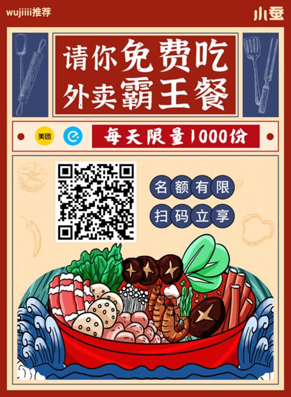

活动名额有限，点单要尽早。具体优惠视当地商家情况而定，实测有很多商家点一餐只要几块钱。

<!--more-->

	

		

			
①

			

				
微信扫码进入小程序或下载app，选择活动完成<strong>报名</strong>。

				  
			

		

		

			

				
②

				

					
到对应平台（美团或者饿了么）完成<strong>下单</strong>，复制<strong>订单编号</strong>粘贴到活动页面。

				

			

			

				
③

				

					
收到外卖，完成<strong>评价截图</strong>（无需评价则直接提交），等待审核通过后即可提现，也可以等攒多一些再提现。

				

			

		

	

