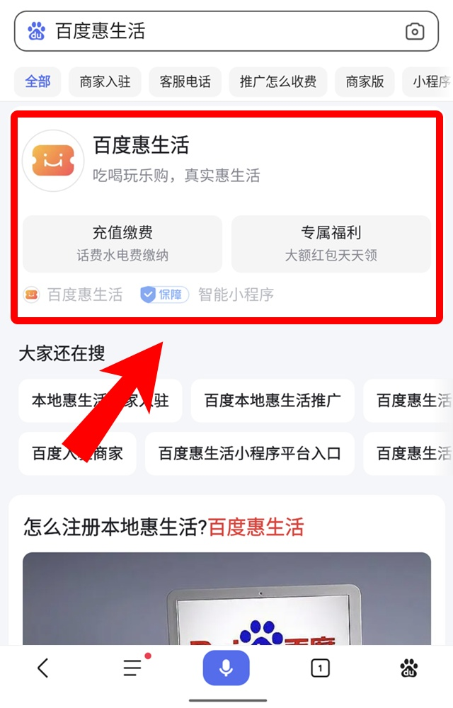
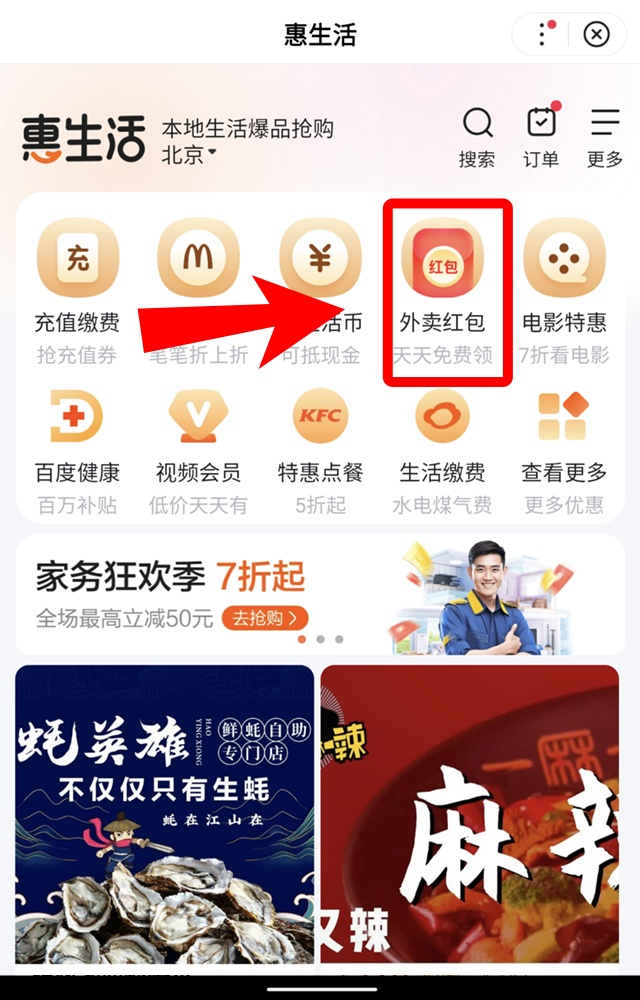
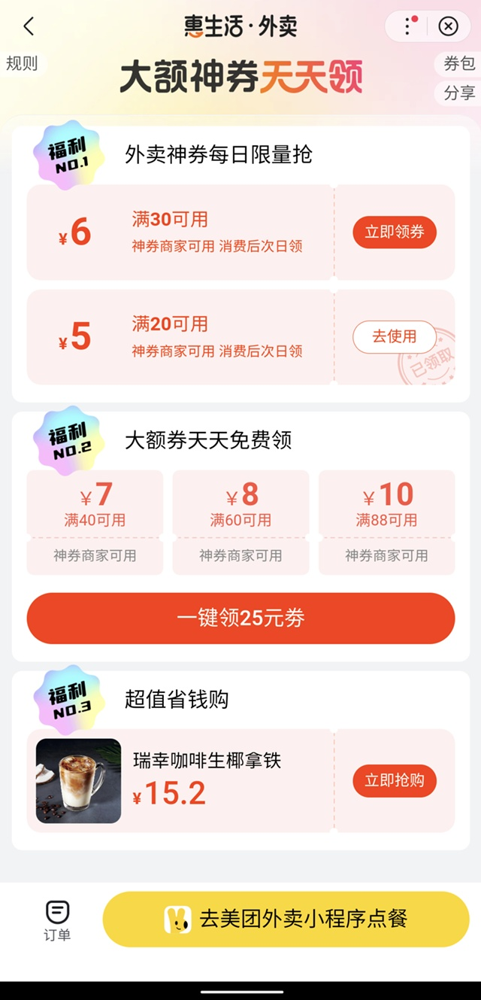

可以领取满20减5、满30减6等**满减券**和瑞幸咖啡等**饮品券**。

<!--more-->

	

		

			
①

			

				
百度app内搜索：<strong>百度惠生活</strong>。

				
			

		

		

			
②

			

				
进入百度惠生活小程序，点击<strong>外卖红包</strong>。

				
			

		

	

	

		

			
③

			

				
领取优惠券，页面内的优惠券只能在百度app内使用。

				
			

		

	

小技巧：百度小程序内只能用微信支付，如果要选择更多付款方式可以在付款前退出，然后在美团内继续完成付款。

