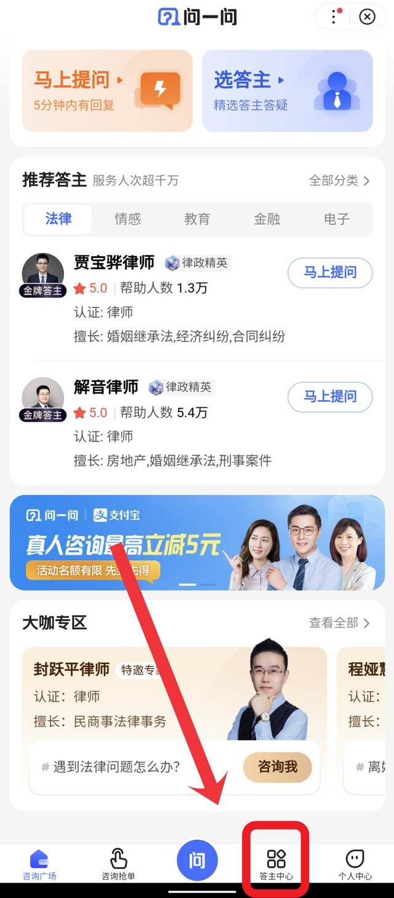
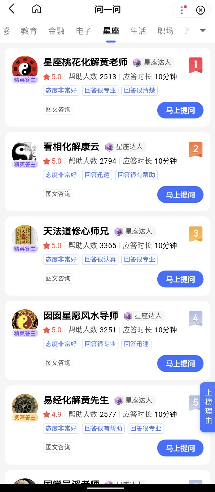

在知识付费的时代，百度问一问项目应运而生。
它可以是普通人搬砖副业，也可以是高级知识付费项目。
废话不多说，开始进入正题。

<!--more-->

## 1 成为答主

操作步骤如图所示：
① 打开百度App，搜索“问一问”
② 进入小程序，点击“答主中心”
③ 完成信息填写、入驻考核

| ① | ② | ③ |
| :---: | :---: | :---: |
|  |  |  |

在选择类目的时候，要选择自己**擅长的类目**，有的提问确实简单，只要稍微搜索一下就能得到答案，但如果你自己一点不了解，就没办法判断得到的答案是否正确。

按流程操作即可，填写完信息后，有一段答主培训视频，这个视频仔细观看有助于快速上手。

### 细节事项

1. AI的答案不要直接使用，不要用百度文心一格回答。
2. 新号需要养号，答题要保持质量，提高数量是在保证质量的前提之下。
3. 不要搞违规操作，答非所问、无意义灌水、自问自答等等，会被封号。
4. 不要信那些卖软件AI答题的，当心号被封掉了。还有机构认证基本也是割韭菜。
5. 早上7-8时，中午12-13时，晚上10时以后单子较多。

如果你对这个项目的定位是：无门槛、容易上手。那么把它当作一个搬砖项目，每天答题按部就班就可以了。但是这只是最基础的一种运用方式，如果想要更有效的利用起来，请看完下一部分。

## 2 进一步分析

百度问一问的产品介绍：为用户提供真人实时在线的问答体验。
以下是三个问一问答主提供的服务类目列表，分别来自生活、金融、法律三个分类（共15个分类）。

| 生活 | 金融 | 法律 |
| :---: | :---: | :---: |
|  |  |  |

**问答的本质是信息交流**，掌握多数人不具备的知识和经验，对于答主就是有天然的优势。如果你是某个领域的专家或者有丰富行业（从业）经验，那么必然就会很吃香。但是并不是说要求每一位答主去做一位专家，而是**找准定位，提出符合自身优势的精准服务**。

例如：老师可以提供改题、答疑服务，汽修师傅可以提供汽车维护和购买咨询等等。没有相关工作经验，可以根据自己的生活经验去提供问答服务，宝妈也可以根据自己的经验提供孕期咨询、育儿咨询等等。

还可以在一些特别的版块找到**新的赛道（需求）**，其实有的时候消费者的需求就是很奇怪，比如下面这些星座、情感答主，收费也不低。还有我之前了解到的倾听师，现代社会许多人焦虑大于压力，可能他们需要的更多是倾听，因为生活、上班的压力无法给家人和朋友述说。

| 星座 | 情感 |
| :---: | :---: |
|  |  |

其实，问一问本身还是一个获取流量的入口，要维持账号的基本活跃度，保证质量，答题数累计上去才能获得一定的流量。凡事贵在坚持。

