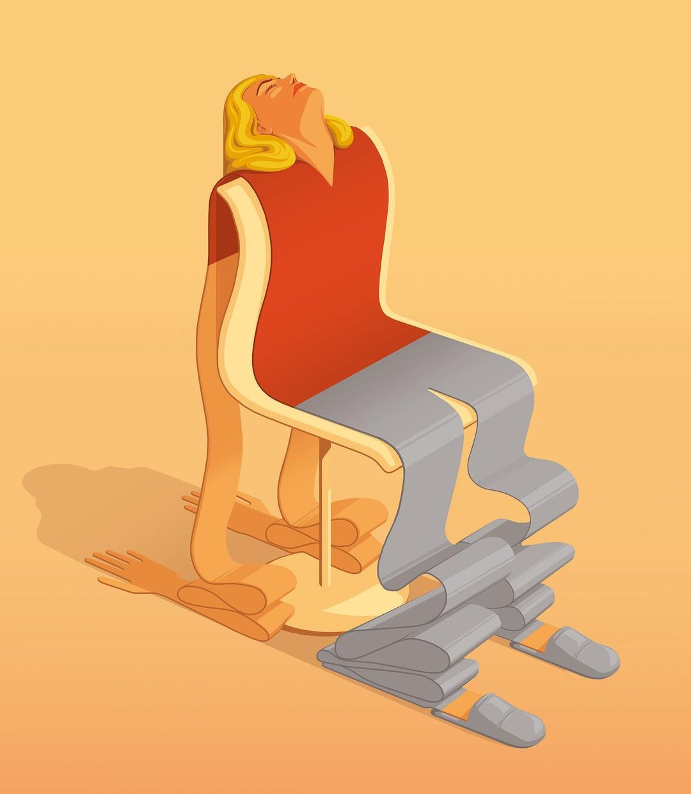
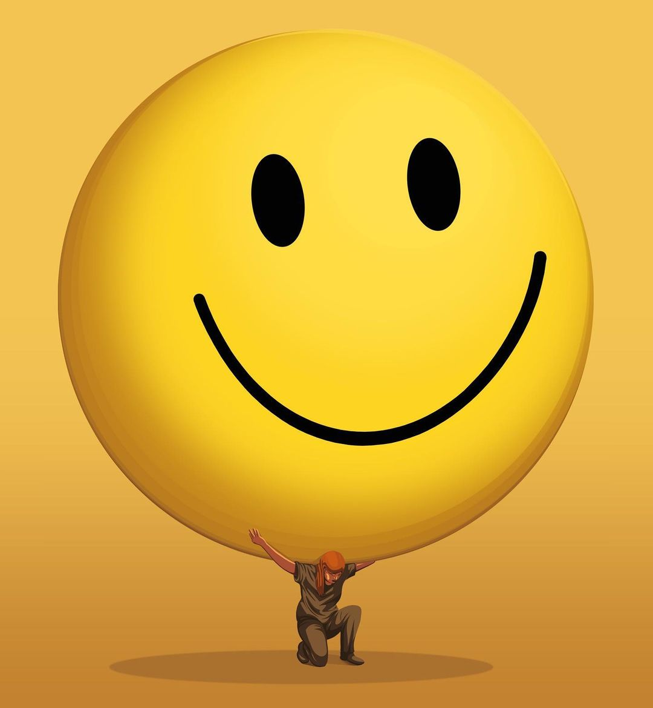
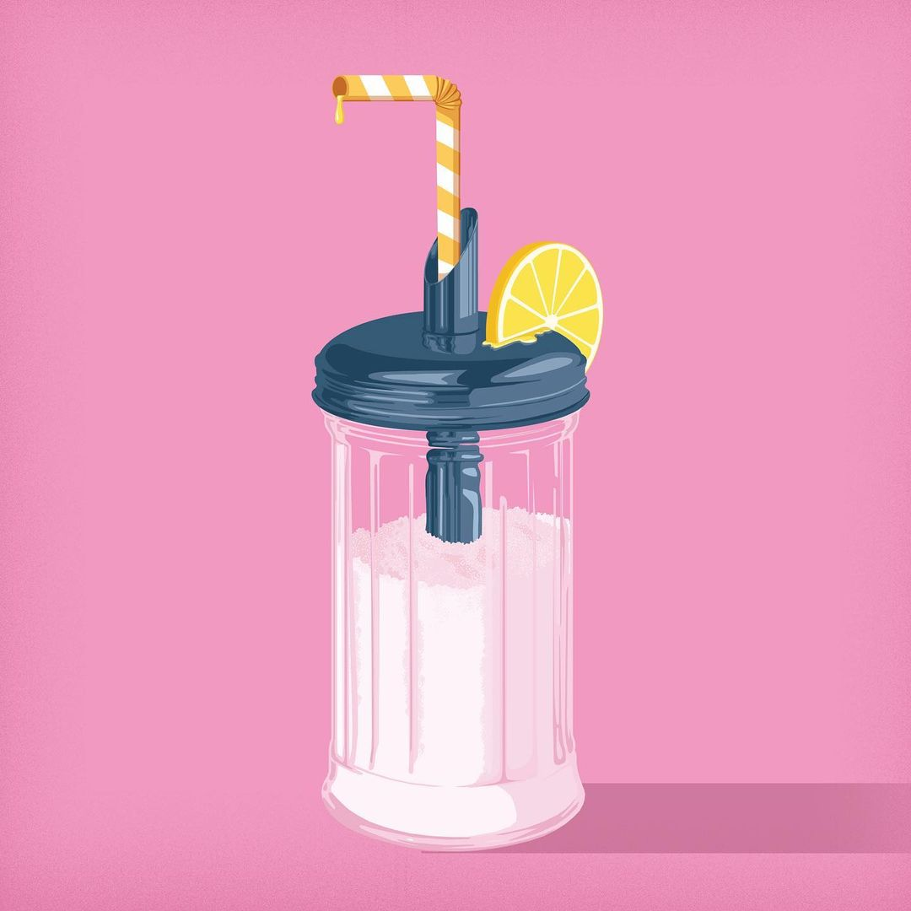

Stephan Schmitz 插画作品

<!--more-->

### 1️⃣ **"I Need a Break"** （我需要休息） 
打工人的常态，日常想躺平。看到这幅画，我想如果我们能像纸片人一样就好了，累的时候就感觉不到身体的重量了。

### 2️⃣ **"The Happiness-lie"** （幸福谎言） 
“社交媒体让我们觉得，如果人并不总是快乐、微笑和看起来最好，那么就会有问题。”

喜怒哀乐是人之常情，如果一个人总是表现乐观积极、情绪高涨，也会有疲乏的时候。在社交媒体上，如果我们受到媒体内容的影响，不得不保持比较愉悦的状态，那么可能在其他时候我们可能会更累。这种精神上的疲累，往往是不自知的。

### 3️⃣  **Lemonade** （柠檬水） 
GEO杂志插图，内容是关于德国的一条法律，要求柠檬水的含糖量要最低

......

如果你也喜欢他的作品，建议去ins围观，上面有其他非常多有意思的作品。
不了解创作背景，容易有理解偏差。

## 闲聊

不知道是不是被国内广告的审美带偏了。
在浏览他的作品的时候，
如果无法一下抓住我的眼球，我就会提不起兴趣。
但是实际上看他的每一幅作品，都非常精美，构思有明显的特点。
这样想，可能有点人不行怪路不平的意思，请手下留情，勿喷。

